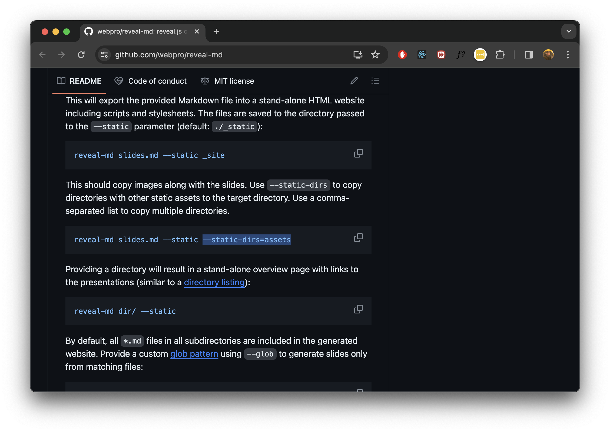

# Typescript

## Вступ

---

## Чому TypeScript?

TypeScript забезпечує строгу типізацію, що допомагає уникати поширених помилок та підвищує продуктивність розробки.

--



---

## Типи даних у TypeScript

Типи даних використовуються для визначення типу змінних, параметрів функцій та значень, які можуть повертати функції. Вони надають статичну перевірку типів, що допомагає уникнути помилок під час виконання коду.

--

`boolean`: Представляє істинність (true) або хибність (false).

```ts
const fact: boolean = true;
```

`number`: Представляє як цілі, так і дробові числа. TypeScript використовує числа з рухомою комою.

```ts
const answer: number = 42;
```

`string`: Представляє послідовності символів або текст.

```ts
const text: string = "Lorem ipsum";
```

--

`Array` Масиви можуть бути описані двома способами: за допомогою типу елементів, що наступає за квадратними дужками (наприклад, `number[]`), або за допомогою загального типу Array (наприклад, `Array<number>`).

```ts
const list: Array<number> = [1, 2, 3];
```

`tuple`: Дозволяє виразити масив з фіксованою кількістю елементів, чий тип відомий, але не обов'язково однаковий.

```ts
const value: [string, number] = ["Hello", 42];
```

`enum`: Дозволяє визначити набір іменованих констант.

```ts
enum Currency {
  Dollar,
  Euro,
}
```

--

`any`: використовується для змінних, тип яких може бути чим завгодно; TypeScript не перевірятиме такі змінні на відповідність типу.

```ts
let value: any = 42;
value = "Lorem";
```

`void`: зазвичай використовується як тип повернення функцій, які не повертають значення.

```ts
function magic(): void {
  doMagic();
}
```

`null` і `undefined`: ці типи використовуються для вказівки відсутності значення або неініціалізованої змінної відповідно.

--

`never`: Представляє тип значень, які ніколи не відбуваються. Наприклад, `never` є типом для функції, яка завжди викидає помилку.

`object`: Представляє не примітивний тип, тобто будь-який тип, який не є `number`, `string`, `boolean`, `symbol`, `null`, або `undefined`.

---

## Анотації типів

Анотації типів дозволяють розробникам явно вказувати типи для змінних та параметрів, забезпечуючи більшу ясність та надійність коду.

--

#### Анотація типу змінної

```ts
let name: string = "Іван";
let age: number = 30;
let isActive: boolean = true;
```

#### Анотація функції

```ts
function greet(name: string, age: number): string {
  return `Привіт, мене звати ${name} і мені ${age} років.`;
}
```

---

## Автоматичне виведення типів

TypeScript може автоматично визначити тип змінної на основі присвоєного їй значення, що спрощує роботу з типами та зменшує кількість коду.

```ts
let name = "Іван"; // Виведений тип: string
let age = 25; // Виведений тип: number
let isActive = true; // Виведений тип: boolean
```

--

### Виведення типів у функціях

TypeScript також може виводити типи, що повертаються функціями, на основі повернених ними значень.

--

### Переваги виведення типів

- Зменшення кількості коду
- Підвищення читабельності
- Спрощення рефакторингу

--

### Недоліки виведення типів

- Неправильне або загальне виведення
- Втрата інформації про тип та зрозумілість
- Проблеми зі сторонніми бібліотеками
- Передбачуваність та рефакторинг

<aside class="notes">

TypeScript може іноді вивести занадто загальний тип або неправильний тип у складних сценаріях, що може призвести до помилок, які важко виявити та виправити.

Автоматичне виведення типів може призвести до втрати явної інформації про тип, що ускладнює розуміння коду, особливо для нових членів команди або після довгого періоду без роботи з кодом.

Проблеми зі Сторонніми Бібліотеками: Використання бібліотек, що не оптимізовані для TypeScript, може призвести до проблем з виведенням типів, вимагаючи додаткових анотацій або визначень типів.

Передбачуваність та Рефакторинг: Надмірне спирання на виведення типів може зменшити передбачуваність поведінки програми і ускладнити рефакторинг, оскільки зміни у одній частині програми не завжди явно відображаються в інших.

</aside>

---

## Складні типи

Складні типи, такі як об'єднання, перетин, та tuple, дозволяють створювати гнучкі структури даних для різноманітних сценаріїв.

---

### Об'єднання (Union Types)

Об'єднання дозволяють змінній мати один з кількох можливих типів. Це особливо корисно, коли функція може приймати або повертати декілька різних типів.

```ts
function printId(id: number | string) {
  console.log("Your ID is: " + id);
}

// Обидва виклики коректні
printId(101); // Your ID is: 101
printId("202"); // Your ID is: 202
```

--

### Перетин (Intersection Types)

Перетини дозволяють комбінувати кілька типів в один. Це корисно, коли ви хочете об'єднати набори властивостей з різних типів.

```ts
type Employee = { name: string; startDate: Date };

type Admin = { name: string; privileges: string[] };

// Об'єднання типів Employee і Admin
type ElevatedEmployee = Employee & Admin;

const e1: ElevatedEmployee = {
  name: "Max",
  startDate: new Date(),
  privileges: ["create-server"],
};
```

--

### Кортежі (Tuple Types):

Кортежі — це масиви з фіксованою кількістю елементів, де кожен елемент має відомий тип.

```ts
let user: [number, string];
user = [1, "Michael"];

console.log(user[0]); // Виводить: 1
console.log(user[1]); // Виводить: Michael

user = [1, "Michael", true];
// Помилка: Присвоєно більше елементів, ніж заявлено в типі
```

---

## Тайпґарди

Тайпґарди (Type Guards) у TypeScript — це техніки, які дозволяють вам вказувати більш конкретний тип у певній області вашого коду. Це важливо, коли ви працюєте з типами, які можуть бути більш ніж одним типом (наприклад, з об'єднаннями), і вам потрібно визначити, який конкретний тип використовується в даному контексті. Тайпґарди допомагають TypeScript коректно вивести тип і забезпечити більшу безпеку типів.

--

### Перевірка типу за допомогою оператора `typeof`

Цей тип тайпґарда використовується, коли ви хочете перевірити простий тип змінної (наприклад, string, number, boolean).

```ts
function padLeft(padding: number | string, input: string): string {
  if (typeof padding === "number") {
    return new Array(padding + 1).join(" ") + input;
  }
  return padding + input;
}
```

--

### Перевірка наявності властивостей за допомогою оператора `in`

Цей тайпґард перевіряє, чи має об'єкт певну властивість.

```typescript
type Fish = { swim: () => void };
type Bird = { fly: () => void };

function move(animal: Fish | Bird) {
  if ("swim" in animal) {
    return animal.swim();
  }
  return animal.fly();
}
```

--

### Користувацькі тайпґарди з `type predicate`:

Предикат типу — це вираз, який виконує перевірку на конкретний тип та повертає boolean результат.

```ts
function isFish(animal: Fish | Bird): animal is Fish {
  return (animal as Fish).swim !== undefined;
}

// Завдяки isFish, TypeScript розуміє, що у true гілці animal є Fish
function move(animal: Fish | Bird) {
  if (isFish(animal)) {
    animal.swim();
  } else {
    animal.fly();
  }
}
```

--

### Використання `instanceof` для класів

Якщо ви працюєте з класами, ви можете використовувати instanceof для перевірки, чи є об'єкт екземпляром певного класу.

```ts
class Date {
  // ...
}

function isDate(value: any): value is Date {
  return value instanceof Date;
}
```
